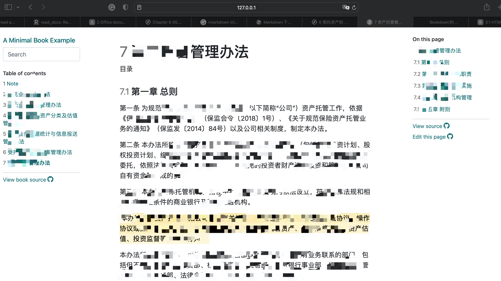
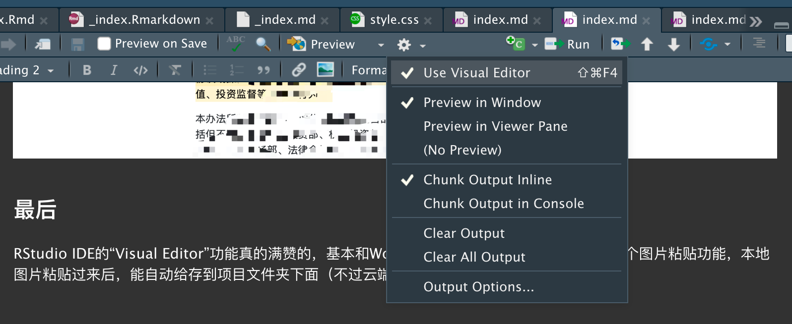

## 铺垫

公司采购的[RStudio Connect](https://www.rstudio.com/products/connect/)只支持Rmarkdown，不支持Rnw自动转成PDF。但对于我来讲正好，因为我实在不喜欢辣眼睛的`$LaTeX$`的斜杠，早就想转成纯Rmarkdown的生态，无奈公司很多时候还是会用到PDF文件，而用Rmarkdown制作商业需要的PDF格式。虽然支持，但试了试感觉还是很麻烦，和在Rnw里手写`$LaTeX$`差不多，总之是偏离了使用Rmarkdown的初心------"简洁"。

之前看见益辉兄的[pagedown](http://github.com/rstudio/pagedown)包，很是震撼，想试着搞一个模板后就直接转过去。然而去年实在太忙，鼓捣了两天后就没时间弄了（倒是给自己搞了个很漂亮的简历模板）。于是乎拖到现在。恰好这两天稍微清闲点，顺便一翻看见了pagedown对于longtable支持的[PR](https://github.com/rstudio/pagedown/pull/250)，感觉有戏。

不过，我铺垫这么多，和pagedown没太大关系，倒是和bookdown有关。

## 正文

今晚遛完娃后，翻了翻[paged.js文档](https://www.pagedjs.org/documentation/)后打算睡了。突然，想到了最近公司的一个小事，就是陆陆续续各部门撰写的制度流程越来越多，但是却没有一个统一的地方可以查看。由于我们是个新公司，OA系统文档管理系统神马的还没采购部署，目前只能在共享盘人肉查阅，非常低效，大家苦不堪言。

我猛然想到：

-   公司下发的制度都有对应的word版本
-   [officer包](https://davidgohel.github.io/officer/)可以很方便读取word里面的文字
-   [bookdown的`bs4_book()`主题](https://bookdown.org/yihui/bookdown/html.html#bs4-book)布局非常适合阅读制度，而且它支持全书的文字查找
-   RStudio Connect可以很方便的进行内容共享，而且还能进行用户权限管理

因此，写个小程序把制度文档内容自动转成markdown格式，做成`bookdown::bs4_book()`后，通过RStudio Connect分享出去，不就可以临时解决这个问题了么？

于是乎，撸起袖子扛扛扛开干------结果还不错，开心，哈哈。

## 不过

这种工作其实是自己给自己找麻烦------因为也没人要求我做。作为一个职场老油条，难道不应该"多一事不如少一事"？但我就是天性如此------喜欢码字，喜欢创造，喜欢看到自己带来的改变能够帮助到别人------这就是我的快乐。

------------------------------------------------------------------------

## 代码

``` r
docx2md <- function(docx_path, md_path) {
  x <- officer::read_docx(docx_path)
  content <- officer::docx_summary(x)
  paragraphs <- content[content$content_type == "paragraph",]
  add_head <- \(x) {
    flag <- x |> stringr::str_detect("^第.{1,3}章")
    flag[is.na(flag)] <- FALSE
    x[flag] <- sprintf("## %s", x[flag])
    x
  }
  bold_item <- \(x) {
    x |> stringr::str_replace("^(第.{1,4}条)", "**\\1**")
  }
  add_title <- \(x) {
    if (length(x)) {
      x[1L] <- sprintf("# %s", x[1L])
    }
    x
  }
  remove_first_company_name <- \(x) {
    if (length(x)) {
      x[1L] <- stringr::str_replace_all(x[1L], "My Company Name", "")
    }
    x
  }
  trim_and_filter <- \(x) {
    x |> stringr::str_trim() |> Filter(f=nchar)
  }
  paragraphs$text |>
    trim_and_filter() |> remove_first_company_name() |> trim_and_filter() |>
    add_title() |> add_head() |> bold_item() |>
    cat(file = md_path, sep = "\n\n", append = TRUE)
}

find_docxs <- function(folder = rstudioapi::selectDirectory()) {
  list.files(folder, pattern = "[.]docx$", full.names = FALSE, recursive = TRUE)
}

clear_content <- function() {
  files <- list.files(".", "^\\d.*md$")
  unlink(files)
}

update_content <- function(folder = rstudioapi::selectDirectory()) {
  # assume types => docx two levels
  types <- list.dirs(folder, recursive = FALSE, full.names = FALSE)
  clear_content()
  for (i in seq_along(types)) {
    type <- types[i]
    docxes <- find_docxs(file.path(folder, type))
    for (k in seq_along(docxes)) {
      md_file <- sprintf("%02d.Rmd", k)
      sprintf("**制度类型: %s**\n\n", type) |> cat(file = md_file)
      docx2md(file.path(folder, type, docxes[k]), md_file)
    }
  }
}
```

## 测试效果



## 最后

RStudio IDE的"Visual Editor"功能真的满赞的，基本和Word使用感受接近了。最方便的就是这个图片粘贴功能，本地图片粘贴过来后，能自动给存到项目文件夹下面（不过云端的RStudio Workbench还不支持）。


