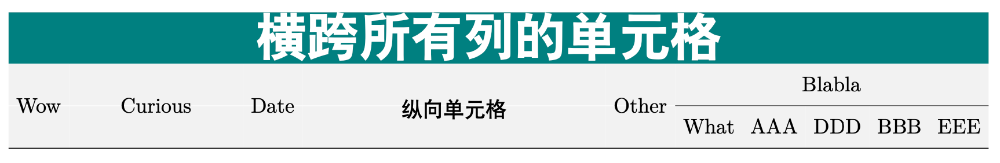

每一门语言都包含一些“隐性知识”。如果不了解这些知识，你会发现使用起来非常困难。这里，我根据自己最近的经验，记录一些关于 `$LaTeX$` 的知识，以便读者和未来的自己可以节省一些时间。

## Texlive 安装

直接使用谢益辉的 [tinytex](https://github.com/rstudio/tinytex)。在有网络连接的情况下[安装](https://github.com/rstudio/tinytex-releases)经典版本，或者在需要完整功能时安装完整版本。不要尝试运行 `tlmgr install scheme-full`，根据我的经验，它是有问题的。错误信息完全看不懂，不要在上面浪费时间。

## `$ctex$`

处理中文内容时，请务必使用 [`$ctex$` 宏包](https://mirror.mwt.me/ctan/language/chinese/ctex/ctex.pdf) 和 `$XeLaTeX$` 引擎。前者是一个 `$LaTeX$` 宏包，提供了对中文样式、字体等的常见支持，而后者支持 UTF-8 编码，这是救命稻草，尤其对 Windows 用户而言。

### 中文字体族

要在 `$ctex$` 中切换中文字体族，应该使用 `\heiti`、`\kaishu` 或 `\CJKfamily`。`$ctex$` 提供了一些内嵌的中文字体，在 Linux 上非常方便，因为你不需要手动安装可能缺少的中文字体。

### 中文字号

在 `$ctex$` 中调整字号时，不要使用 `\fontsize`，必须使用 `\zihao`。否则，你可能会发现中文和英文的字号不一致。

此外，`\zihao{5}` 会像 `\heiti` 一样影响其后整个环境的字号。

### 将默认英文字体改为无衬线体

我发现在很多场景下，使用“无衬线体”（如 Arial）的英文字体比“衬线体”（如 Times New Roman）更合适。以下命令可以实现这一设置。

``` latex
\renewcommand*{\familydefault}{\sfdefault}
```

## `$longtable$`

我经常发现 [`$longtable$` 宏包](https://mirrors.concertpass.com/tex-archive/macros/latex/required/tools/longtable.pdf) 在制作表格时非常有用，因为让表格跨页显示通常比浮动到下一页、留下大片空白区域更好。而且，与普通的 tabular 表格相比，它提供了更好的默认样式和许多方便的命令。

### 设置列宽

首先，你需要 `$array$` 宏包。

然后，在 `\begin{longtable}{}` 中使用这个看起来很丑的命令 `>{\raggedright\arraybackslash}m{1.2in}`。注意，`raggedright` 表示左对齐，`raggedleft` 和 `centering` 分别表示右对齐和居中对齐。宽度 "1.2in" 可以改为任何有效的单位，例如：

``` latex
\begin{longtable}{>{\raggedright\arraybackslash}m{5cm}r}
...
\end{longtable}
```

### 设置合并列或合并行

使用 `$multicol$` 和 `$multirow$` 宏包。参见文末的示例。

### 对特定行应用样式

1.  使用 `$booktabs$`、`$color$`、`$colortbl$` 宏包
2.  在行内容之前（但在 "rule" 之后，如 `\toprule`，否则表格上可能出现黑色色块）添加 `\rowcolor{}`
3.  颜色可以通过 `\definecolor{azblue}{rgb}{0,0.22,0.51}` 来定义（需要将 rgb 值除以 255）。

### 去除行线周围的“白色填充”

为行设置背景色时，通常不希望行线周围出现白色填充。以下命令可以消除这些“填充”。

``` latex
\setlength{\aboverulesep}{0pt}
\setlength{\belowrulesep}{0pt}
```

### 缩小列间距

``` latex
\setlength{\tabcolsep}{4pt}
```

## 示例

``` latex
\documentclass[a4paper, landscape]{ctexart}
\usepackage[dvipsnames]{xcolor}
\usepackage{pdfpages}
\usepackage{fontspec}
\usepackage{longtable}
\usepackage{booktabs}
\usepackage{array}
\usepackage{multicol}
\usepackage{multirow}
\usepackage{colortbl}
\usepackage{color}
\usepackage{tikz}
\definecolor{light-gray}{gray}{0.95}
\definecolor{defcolor}{rgb}{0,0.5,0.5}
\addtolength{\hoffset}{-1in}

\begin{document}

\heiti

\setlength{\aboverulesep}{0pt}
\setlength{\belowrulesep}{0pt}
\setlength{\tabcolsep}{4pt}
% this add row height
\renewcommand{\arraystretch}{1.2}

\begin{longtable}[l]{c>{\raggedright\arraybackslash}m{1.1in}c>{\centering\arraybackslash}m{2in}cccccc}

\rowcolor{defcolor} \multicolumn{10}{c}{\textcolor{white}{ \zihao{1}  \bfseries{横跨所有列的单元格} }} \\

\rowcolor{light-gray} & & & & & \multicolumn{5}{c}{Blabla} \\
\cmidrule{6-10}
\rowcolor{light-gray} \multirow{-2}{*}{Wow} & \multicolumn{1}{c}{\multirow{-2}{*}{Curious}} & \multirow{-2}{*}{Date} & \multirow{-2}{*}{纵向单元格} & \multirow{-2}{*}{Other} & \multicolumn{1}{c}{What} & \multicolumn{1}{c}{AAA} & \multicolumn{1}{c}{DDD} & \multicolumn{1}{c}{BBB} & \multicolumn{1}{c}{EEE} \\
\midrule

\end{longtable}
\end{document}
```


