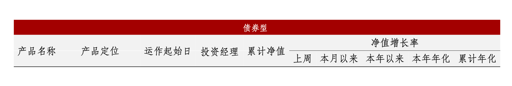

Every language contains "hidden knowledge". Without knowing it, you may find it's very difficult to use the language. Here, I write some knowledge on `$LaTeX$`, according to my experience recently, so that the readers and the future-myself can save some time.

## Texlive installing

Just use Yihui's tinytex. Either installing the classical one with Internet connectivity, or installing the full one when full capacity is required. Do not try to `tlmgr install scheme-full`. It's broken, based on my experience. The error message is not understandable. Do not waste time on it.

## `$ctex$`

When working with Chinese letters, do please use [the `$ctex$` package](https://mirror.mwt.me/ctan/language/chinese/ctex/ctex.pdf) and `$XeLaTeX$` engine. The former is a `$LaTeX$` that provides common supports on Chinese styles, fonts, etc, while the latter enables UTF-8 encoding, which is a life-saver, especially for Windows users.

### Chinese Font Family

To change the Chinese font family in `$ctex$`, you should use `\heiti` or `\kaishu`, or `\CJKfamily`. `$ctex$` provides some embedded Chinese fonts and it's very convenient in Linux, as you don't need to install the possible missing Chinese fonts manually.

### Chinese Font Size

When you want to adjust the font size in `$ctex$`, do not use `\fontsize`. Instead, you must use `\zihao`. Otherwise, you may find the font sizes of Chinese letters and English letters are different.

In addition, `\zihao{5}` will affect the rest of the environment just like `\heiti` does.

### Change the default English font to "sans-serif"

I find it's often desired to use "sans-serif" (e.g., Arial) English fonts rather than "serif" (e.g., Times New Roman). The following command enables that.

``` latex
\renewcommand*{\familydefault}{\sfdefault}
```

## `$longtable$`

I often find [the `$longtable$` package](https://mirrors.concertpass.com/tex-archive/macros/latex/required/tools/longtable.pdf) useful when making tables, as displaying a table across pages is usually a better choice than floating to the next page, leaving a huge blank area. Moreover, it provides a better default style with many handy commands than the normal tabular tables.

### set the column width

Firstly, you need the `$array$` package.

Then, use this very ugly command `>{\raggedright\arraybackslash}m{1.2in}` in `\begin{longtable}{}`. Note, `raggedright` means left-align while `raggedleft` and `centering` means right-align and middle-align, respectively. The width "1.2in" can be changed to any valid unit, e.g.:

``` latex
\begin{longtable}{>{\raggedright\arraybackslash}m{5cm}r}
...
\end{longtable}
```

### Set multiple columns or rows

Use `$multicol$` and `$multirow$` package. See the example at the end.

### Apply styles on certain rows

1.  Use the `$booktabs$`, `$color$`, `$colortbl$` packages
2.  Add `\rowcolor{}` before the row content (but after "rule", e.g., `\toprule`, or it may display black block on the table)
3.  The color can be defined via `\definecolor{azblue}{rgb}{0,0.22,0.51}` (you need to divide the rgb value by 255).

### Remove the "white padding" around row lines

When setting a background color for a row, often you don't want the white padding around the row lines. The below commands make the "padding" disappears.

``` latex
\setlength{\aboverulesep}{0pt}
\setlength{\belowrulesep}{0pt}
```

### Narrower the column padding

``` latex
\setlength{\tabcolsep}{4pt}
```

## An example

``` latex
\documentclass[a4paper, landscape]{ctexart}
\usepackage[dvipsnames]{xcolor}
\usepackage{pdfpages}
\usepackage{fontspec} 
\usepackage{longtable} 
\usepackage{booktabs} 
\usepackage{array}
\usepackage{multicol}
\usepackage{multirow}
\usepackage{colortbl}
\usepackage{color}
\usepackage{tikz}
\definecolor{light-gray}{gray}{0.95}
\definecolor{red}{rgb}{0.64,0,0}
\addtolength{\hoffset}{-1in}

\begin{document}

\fangsong

\setlength{\aboverulesep}{0pt}
\setlength{\belowrulesep}{0pt}
\setlength{\tabcolsep}{4pt}

\begin{longtable}[l]{c>{\raggedright\arraybackslash}m{1.1in}c>{\centering\arraybackslash}m{0.6in}cccccc}

\rowcolor{red} \multicolumn{10}{c}{\textcolor{white}{ \zihao{-5}  \bfseries{债券型} }} \\
\rowcolor{light-gray} & & & & & \multicolumn{5}{c}{净值增长率} \\
\cmidrule{6-10}
\rowcolor{light-gray} \multirow{-2}{*}{产品名称} & \multicolumn{1}{c}{\multirow{-2}{*}{产品定位}} & \multirow{-2}{*}{运作起始日} & \multirow{-2}{*}{投资经理} & \multirow{-2}{*}{累计净值} & \multicolumn{1}{c}{上周} & \multicolumn{1}{c}{本月以来} & \multicolumn{1}{c}{本年以来} & \multicolumn{1}{c}{本年年化} & \multicolumn{1}{c}{累计年化} \\
\midrule

\end{longtable}
\end{document}
```


