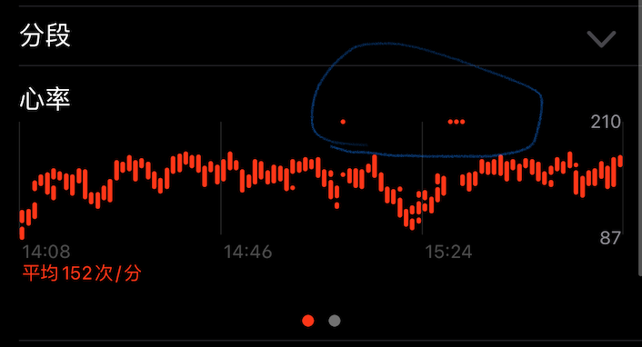
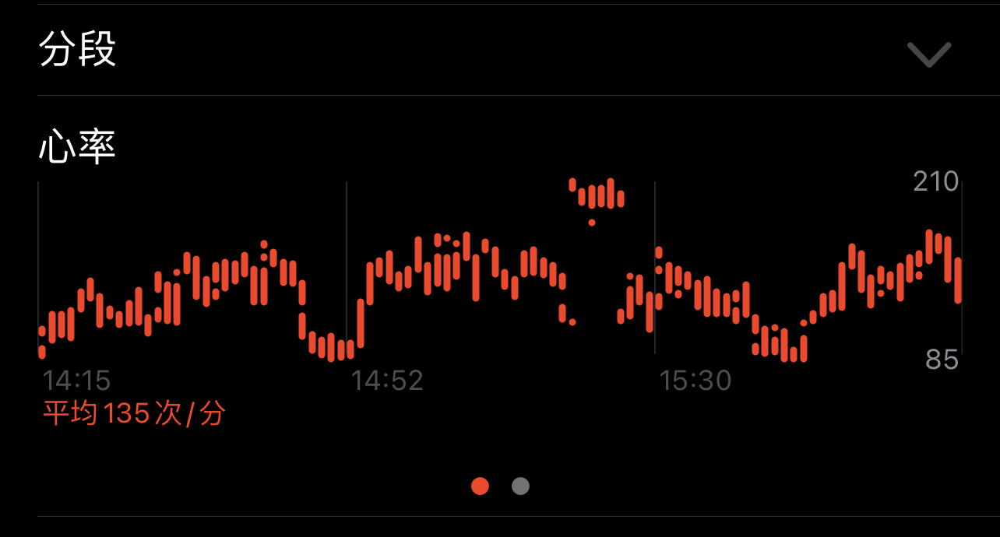

## 预激综合征

我有轻微的[预激综合征](https://baike.baidu.com/item/预激综合征/2255765)。当参见剧烈运动如踢球时，有一定概率会诱发。此时，心跳会升至200左右，然后会持续10分钟至一小时不等。一般要休息后，会突然从200恢复至正常。

不必担心我的身体，大夫说我这种属于很轻微的，不用特意治疗，也不会影响我健康。只不过，参加剧烈运动时一旦发作，人会觉得很不舒服，基本就得下场休息了。此外，从8岁第一次出现这个症状以来，随着经验的增多，我已经比较熟悉这个病症了，能够比较有经验地对付它。

前几周去踢足球，2个小时的运动中，发作了两次。但神奇的是，这两次我都在1-3分钟内就彻底控制住恢复了。恢复的时候，也没有像之前一样，"叮咚"一下从比较高的心率回去，而是基本没啥感觉就好了（为了确认不是幻觉，我找到了当时Apple Watch监测的心率数据，附到了最后）。

为什么这两次能比较自主地控制呢？我想，这有可能是巧合，**但更有可能的原因是，我现在能够真正彻底地集中注意力，完全不去想应激综合征发作的事情**，反而把这个病症控制下来了。因为，这个病症本质上不完全是物理的问题，而是神经系统指令的紊乱。

## 不去想

“不去想”的境界是无法通过努力地去**想**“不要去想某事”来达到的，越是想便越是烦恼。而深切地体验生命当下的存在，拥抱和接受这一刹那的所有，接受生命可能随时消亡的事实，才能真正“不去想”。

## 附：心率数据对比

### 本次的情况

### 之前的情况

