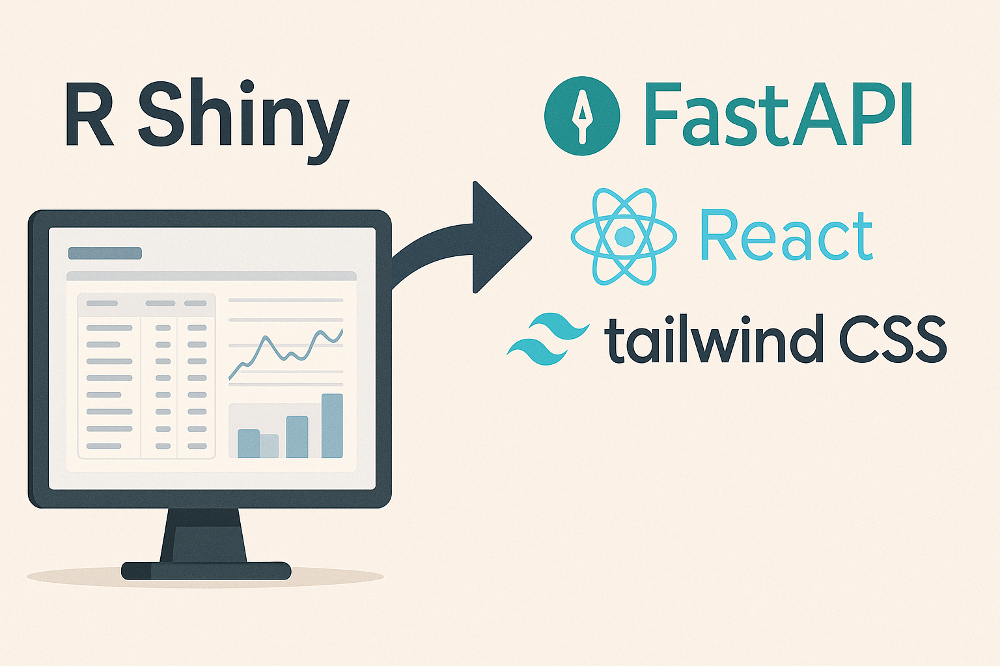

五一假期期间，我请了几天年假，原计划与孩子共度美好时光，谁知从假期第一天清晨开始，孩子就患上了急性肠胃炎，连续几天呕吐腹泻，茶饭不思。在照顾孩子之余，我抽空研究了FastAPI + React + Tailwind的技术框架组合。**直观感受是，结合"Vibe Coding"（AI辅助编程）后，这个框架比R Shiny更适合正式的工作场景，即便主要用于数据报表和可视化展示。**

## R Shiny的魔法

我从2014年底开始接触R Shiny框架，算是这项技术最早的一批实践者。初次使用R Shiny时，那种发现新大陆的兴奋感至今难忘------这是我首次遇到一个能以如此简洁方式实现丰富交互功能的Web框架，特别适合资产管理等内部系统场景：主要是多维度展示数据，用户输入相对较少。

值得回顾的是，在那个数据科学浪潮刚刚重启的年代，Python连像样的DataFrame支持库（Pandas）都刚刚问世，交互式数据展示框架几乎一片空白。当时只能用非常笨拙的方式实现交互，若选择Web开发则需编写大量HTML+JS代码。而R Shiny宛如魔法般，仅需数十行代码就能构建出极为美观的Web数据展示界面。从2015年到2022年，我因工作需要用R Shiny开发了多个中大型项目，主要围绕投资组合分析。

## Python Shiny的不成功

近年来，RStudio更名为Posit，并推出了Python Shiny，但它从未真正流行起来。我尝试使用过几次，感觉社区生态并未建立，也未能很好地结合Python的工程特性，略显不伦不类。反而是Python的Dash等简单框架获得了更多青睐。这让我思考：~为何在我看来如此强大的R Shiny理念无法在Python生态中复制成功？看来这不仅仅是R语言普及度的问题。

## Shiny框架的缺点

在长期使用R Shiny的过程中，我也逐渐认识到框架自身的一些局限。外界常质疑的单线程问题、生产环境适用性等，其实有多种解决方案。特别是在有data.table这类高效数据处理工具的支持下，性能通常不是瓶颈。然而，R Shiny的优势恰恰也成为了它的弱点------简洁灵活的表达力反而弱化了工程特性，在中大型项目中表现尤为明显。 具体而言，主要有两个缺点：

1.  缺乏静态分析支持（这也是R语言的固有弱点）
2.  前后端不分离带来的隐性复杂度增加

这两个问题在AI时代变得更加突出。

### 静态分析支持缺失带来的问题

静态分析支持的缺失源于R语言本身的动态特性。然而，R语言未能像Python那样逐步增加类型系统支持。这种缺失在实际工程中带来了几个层面的问题：

**1.** **函数返回类型难以预知**，必须人工处理大量边缘情况，在复杂交互关系中尤为明显。 

**2.** **认知负载过高**，实际工作环境中，通常只在项目初期投入大量精力构建系统，后续仅通过零散时间维护和迭代功能。即使设计时充分考虑系统解耦，类型系统的缺失仍会导致每次改动都难以全面预估影响。系统演进需要不断重构，但每次重构都要求开发者完整重新熟悉所有代码并在脑中构建模型，在实际工作中几乎不可能实现。这最终导致开发效率问题------初期开发虽然敏捷，但后期维护举步维艰，开发团队往往不愿再增加任何功能。 

**3.** **不适配AI时代需求**，在当前AI辅助编程盛行的环境下，缺乏静态分析支持可能是致命缺陷。AI的编码能力虽然强大，但不可能100%正确。仅靠单元测试只能解决部分问题，而良好的类型系统支持能通过静态分析识别常见问题，更好地发挥AI的潜力。

我曾期望Python Shiny能解决这些问题，但如前所述：社区远不如R Shiny活跃，难以覆盖实际工作所需场景（如缺乏类似DT的强大表格库）；对静态分析支持不足，使用过程中linter报错频发；设计不佳，既不能让R Shiny用户感到熟悉，也不能让Python用户感到舒适，犹如一个半成品。

### 前后端不分离的隐患

前后端不分离带来的问题更为隐蔽，这是Shiny框架的根本约束。对于小型展示项目，这完全够用------用简洁代码以交互方式美观展示数据已经相当出色。然而，许多工作场景需要对细节进行精细调整和控制，需要实现粒度控制(Granularity Control)。

Shiny框架的优势在于隐藏了前端细节，但在这些场景下却成为劣势------要么需要投入大量时间研究底层机制，要么必须采用变通方式实现。除了前端控制粒度不足的问题外，更致命的是前后端不分离架构对计算模型提炼的影响。

前后端不分离的优点是起步简单、代码量少，但缺点是后端模型和计算逻辑不可避免地混杂在前端代码中。这导致难以提炼出清晰分离的计算模型，无法从业务概念上实现彻底解耦。这种表面上的简洁表达和看似不高的耦合性，在项目后续演化中逐渐成为重要障碍。无论是界面调整还是计算逻辑修改，都要求开发人员重新梳理整个项目才能进行，造成与静态类型缺失类似的“认知负载”问题，这可能是中大型项目缺乏演化能力、最终失去生命力的关键原因。

理论上，我们也可以在R Shiny中实现前后端分离，但这样就抛弃了Shiny框架的核心优势，那么使用它的意义也就不大了。

## FastAPI+React

借此机会，我简单研究了REST API的设计哲学。它的无状态设计本质上是一种基于资源的架构，能在系统设计层面实现低耦合，对架构设计、计算弹性等多方面带来显著好处。Python的FastAPI框架已相当成熟，结合Pydantic对静态分析和运行时类型保证都非常出色，能确保前端获取数据的类型稳定性。

另一方面，React + Tailwind CSS经过无数公司反复使用和迭代，已极度强大和成熟。结合AI工具（如Cursor、Windsurf等），我们无需手写大量HTML或记忆繁杂的CSS属性，就能设计出美观的前端页面。得益于前后端分离设计和React的模块化特性，调整页面内容时思维负担大大减轻。此外，这种架构强制我们仔细思考REST API层面应提供什么资源和模型，从资源视角审视业务模型，往往能带来新的理解。

从我这几天的实践来看，这条技术路线，可能更适合我现在面对的工作场景。另外，我们公司用的 Posit Connect 平台也能很好地支持静态页面和 FastAPI 的部署，这意味着我可以在现有的工作流程下，平滑地切换到新的框架和工具。

## 结论与建议

R Shiny仍然是一个出色的框架，在R语言生态中表现卓越，适用于中小型数据展示项目，特别是偏研究而非正式商业场景。Python Shiny因设计问题和社区不成熟，仅建议用于小型非正式项目------当然也可以选择Python Dash等框架，效果类似且社区可能更活跃（意味着更易找到问题解决方案）。

对于大型项目，我建议采用REST API（如Python FastAPI）构建后端，前端使用React + Tailwind CSS，并借助AI工具辅助开发，快速实现美观效果，同时保持系统的可维护性和可扩展性。
