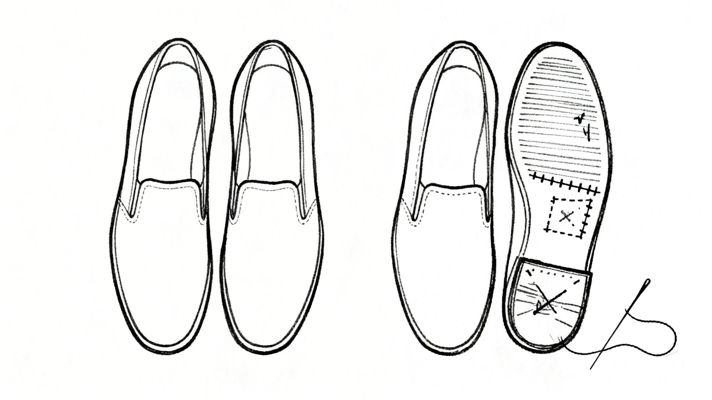

Garry Tan 的 [gstack](https://github.com/garrytan/gstack) 最近很火——GitHub 近两万 star，Product Hunt 上趋势第一，到处都在讨论。他用这套 Skills 在 50 天里平均每周写 10,000 行代码、合并 100 个 PR。

我装过，认真用了一段时间，然后全删了。

不是因为它不好。gstack 里有些思路确实有价值。比如 `/plan-ceo-review` 这个 Skill，让 AI 从 CEO 和产品的视角来审视一个功能——这对我来说很有用，因为我做事更偏产品思维，不只是关心工程实现。但用了一段时间，我发现它背后的判断框架是 Garry Tan 的——他的经验、他接触的项目、他的决策偏好。这些东西偏“老派”，和我自己的思路有出入。

我需要的不是照搬他的 CEO review，而是在他的基础上改造出我自己的版本。

这个认识让我开始重新思考 Skill 到底应该是什么。

### Skill 是做事的思路，不是知识

很多人（包括一开始的我）把 Skill 当成一种“给 AI 补知识”的方式——把领域知识、最佳实践、技术规范塞进去，让 AI 干活时更专业。

但用了一段时间，我觉得这事没那么简单。

AI 不缺知识。大模型本身的训练数据覆盖面极广，再加上 Web Search 能实时获取最新信息，项目上下文提供了具体代码和架构细节。你能想到的绝大多数“知识”，AI 都能自己获取。把知识塞进 Skill 里，不但占用宝贵的上下文窗口，而且这些知识往往不够具体——太泛了没用，太细了又只适用于特定场景。

Skill 真正应该做的事情是把你做事的思路描述出来——面对一个任务，怎么拆解、怎么判断、先做什么后做什么、什么时候该停下来想一想。不是“是什么”（what），而是“怎么做”（how）。

拿写博客来说。AI 知道 Markdown 语法，知道 Hugo 的 front matter 格式，知道好文章应该有清晰的结构。这些都是知识，不需要 Skill 来教。但“怎么和我协作写一篇博客”——先理解我的素材和意图，确认结构，写初稿，配图，迭代修改——这是我做事的方式，是 Skill 应该承载的东西。

### 每个人做事的方式都不一样

理解了这一点之后，一个推论自然就来了：**别人的 Skill 可以借鉴，但不太可能直接拿来用。**

这不是质量问题，是匹配问题。每个人对“怎么做事”的理解不一样。有人喜欢先规划再动手，有人喜欢边做边调整。有人写代码时习惯先写测试，有人习惯先跑通主流程再补测试。有人做 code review 看重架构一致性，有人更在意边界条件和错误处理。

回到 gstack 的例子。我觉得它的 CEO review 思路很好——在动手之前从产品和商业的角度想清楚这件事值不值得做。这个视角很多纯工程背景的人缺乏。但 Garry Tan 在这个 Skill 里嵌入的判断标准、提问方式、关注重点，都带着他自己的经验和偏好。我需要把这个思路提取出来，按照我自己的判断框架重新组织。

所以问题不在于 gstack 好不好，而在于：**它反映的是 Garry Tan 做事的方式**。你和他的角色不同，项目不同，思考习惯不同。直接用他的思路做事，就像穿别人的鞋——不是鞋不好，是脚型不一样。

### 成本低了，该个性化了

过去我们只能用通用工具，因为定制成本太高。一套 SaaS 产品要服务几万用户，只能取最大公约数——每个人的需求都不完全满足，但大家凑合着用。

但 Skill 的定制成本几乎是零。它就是一个 Markdown 文件，几百行文字描述你做事的过程。不需要写代码，不需要搭架构，不需要维护数据库。改一行、存一下，下次对话就生效了。

这意味着我们其实没有理由不为自己定制。

当成本足够低的时候，“通用”不再是优势，反而是妥协。一个精确匹配你思路的 Skill，哪怕简陋粗糙，也比一个精心设计但不是为你设计的 Skill 好用。

### 找到自己的迭代方式

我的建议不是从零开始。完全从零写 Skill 效率不高，也容易闭门造车。我自己的做法是：

1. **先找** — GitHub 上、社区里看看有没有和你需求相关的 Skill。gstack 也好，其他开源 Skill 集合也好，都可以看。
2. **试用，然后问为什么** — 用一段时间，注意哪些环节顺畅、哪些别扭。特别留意：顺畅的部分是因为什么设计选择？别扭的部分是因为它做了什么假设？
3. **根据自己的需求改造** — 把别扭的部分改掉，把缺失的部分补上。你对自己的做事方式比任何人都了解。
4. **持续迭代** — 用一次改一点，每次都比上次好一点。Skill 不是写完就定稿的东西，它应该和你的做事方式一起演进。

这个循环才是关键。不是找到一个“正确的” Skill 然后一直用，而是不断迭代你自己做事的思路。

### 你的做事方式是你最独特的部分

知识是共享的——同一个技术文档、同一本书，大家看的都一样。AI 能获取的知识更是一样的。

但做事的方式是你自己的。它沉淀了你的经验、偏好、判断标准、做事节奏。它是你区别于其他人的东西，也是你能持续提升效率的地方。

打造你自己的 Skill，其实就是把你做事的思路显式化。而当你把它显式化之后，你不仅能让 AI 更好地配合你工作，也会更清楚地理解自己到底是怎么做事的。

这才是我觉得最值得投入的事。
