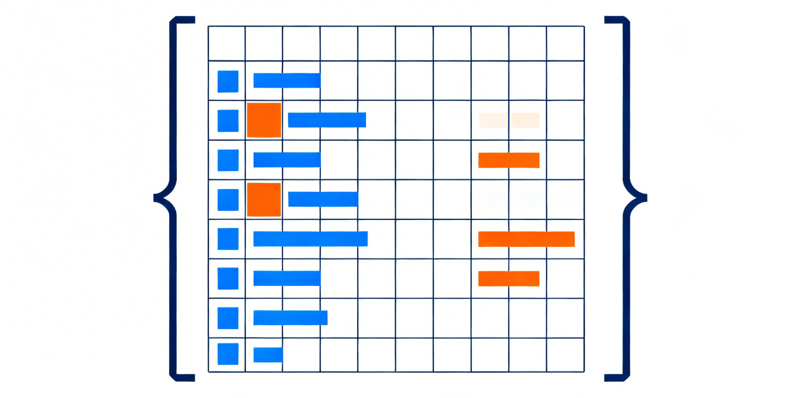

I've spent serious time with all the mainstream DataFrame tools over the years -- dplyr, Pandas, Polars. After all that, I've come to believe that data.table is simply the best data analysis tool out there. Nothing else comes close.

R has its strengths. Python has its strengths. No argument there. But when it comes to DataFrame operations themselves -- filtering, transforming, grouping, joining -- that's what data analysis boils down to day-to-day. That's all I'm talking about here.

Why does data analysis revolve around DataFrames? Because two-dimensional tables are the limit of what human eyes can directly comprehend. Excel is 2D. CSV is 2D. SQL results are 2D. Higher-dimensional data ultimately has to be flattened into 2D before people can make sense of it. How good your DataFrame tool is directly determines your productivity.

### `DT[i, j, by]` -- The Source of Expressiveness

data.table has exactly one syntactic form: `DT[i, j, by]` -- which rows (i), what to compute (j), grouped by what (by). It looks odd at first, but the design is genuinely brilliant (credit to Matt Dowle).

The key insight is that **i, j, and by work together within a single expression, not as independent stages in a pipeline**. This is fundamentally different from dplyr's `filter() %>% mutate() %>% group_by()` pipe, Pandas' method chaining, or Polars' `filter().with_columns().group_by()`. Pipeline syntax splits filtering and subsequent operations into separate steps. Each step looks clear enough on its own, but when operations are coupled -- "only modify certain rows," "compute grouped statistics on a filtered subset" -- things get awkward.

Start with the most basic example: **updating certain rows in place**.

**data.table:**
```r
DT[age > 30, salary := salary * 1.1]
```

One line. Filter rows where `age > 30`, multiply their `salary` by 1.1, modify in place, no copying.

**dplyr:**
```r
DF <- DF %>% mutate(salary = if_else(age > 30, salary * 1.1, salary))
```

No concept of "only modify certain rows." You have to write a conditional expression over the entire column, manually repeating `salary` as the else branch in `if_else`.

**Pandas:**
```python
df.loc[df["age"] > 30, "salary"] *= 1.1
```

Reasonably concise, but column names are all strings with no autocomplete.

**Polars:**
```python
df = df.with_columns(
    pl.when(pl.col("age") > 30)
    .then(pl.col("salary") * 1.1)
    .otherwise(pl.col("salary"))
    .alias("salary")
)
```

Polars simply doesn't support modifying specific rows in place. You have to apply `when/otherwise` to the entire column, then replace it wholesale. Five lines of code to express what takes one.

This isn't an edge case. It's one of the most common operations in data analysis.

### When i, j, and by Come Together

The example above is still relatively simple. The real gap shows up when i, j, and by work in concert.

For instance: **among active users, compute each person's salary share within their region, and write the result back to the original table**.

**data.table:**
```r
DT[status == "active", pct := salary / sum(salary), by = region]
```

One line, three things at once: filter to active users (i), compute each person's salary as a proportion of total active salaries in that region (j), group by region (by), and write back in place. Note that `sum(salary)` only includes active users -- because i's filter takes effect before by's grouping.

**dplyr:**
```r
DF <- DF %>%
  group_by(region) %>%
  mutate(pct = if_else(
    status == "active",
    salary / sum(salary[status == "active"]),
    NA_real_
  )) %>%
  ungroup()
```

Since dplyr's `mutate` operates on all rows, you can't say "only run this computation on active rows." If you write `sum(salary)` without an extra condition, it sums the entire region including inactive users -- different semantics from the data.table version. You have to nest another filter inside `sum()`. Five lines plus nested logic.

**Polars:**
```python
active = df.filter(pl.col("status") == "active")
active = active.with_columns(
    (pl.col("salary") / pl.col("salary").sum())
    .over("region")
    .alias("pct")
)
df = df.join(active.select("id", "pct"), on="id", how="left")
```

Polars requires filtering into a subset, running a window computation on that subset, then joining back to the original table. Three steps, and you need an id column for the join.

This is the cost of pipeline syntax -- **filter and mutate are separate, so you can't say "compute on matching rows and write back in one shot."** data.table puts where (i) and what (j) in the same expression, and this design lets many common operations be expressed precisely in a single line.

Here's an even more typical case: **match by security code, with dates falling within a range, and aggregate the matches** (non-equi join + grouped aggregation).

**data.table:**
```r
B[, total_volume := A[B, .(sum(trade_volume)),
  by = .EACHI,
  on = c("security_code", "date>=start_date", "date<=end_date")]$V1
]
```

Join conditions, aggregation logic, and assignment -- all in one expression.

The same thing in Pandas requires a `merge`, then filtering the date range, then `groupby` aggregation, then `map`ping back -- at least six or seven lines plus a bunch of intermediate variables. Polars has `join_where`, but still nowhere near this compact.

This density of expression comes from R's NSE (Non-Standard Evaluation). Inside `DT[...]`, column names are variables, and any R expression can be freely composed. This isn't just clever API design -- it's a language-level capability difference.

### Keys -- Overlooked Infrastructure

data.table has a basic but important concept: Keys.

```r
setkey(DT, security_code, date)
DT["A"]                              # binary search on key
DT[.("A", as.Date("2024-01-01"))]    # multi-column key lookup
A[B, on = "security_code"]           # joins automatically use keys
```

Keys are like primary keys and indexes in SQL. Once declared, data.table physically sorts the data, and subsequent queries and joins use binary search -- O(log n) instead of O(n). More importantly, **keys declare your semantic understanding of the data** -- which columns uniquely identify a row and how the data is ordered.

Pandas used to have the `index` concept with a similar intent, but it was confusing in practice -- when to `reset_index()`, when not to. The community has been arguing about it for years, and most people just avoid it now.

Polars and dplyr have no such concept at all. Every join requires manually specifying the on columns, with no way to declare "this is the primary key of this table." It may seem like a simpler mental model, but it sacrifices an important layer of semantic information.

My own habit is to `setkey()` as soon as I get a table -- it's both a performance optimization and a way of telling myself (and anyone reading the code) what the logical structure of this data is.

### Speed and SQL Translation

Speed is also a data.table strength -- it consistently tops the benchmarks. But for most analysis scenarios, speed is secondary.

Polars is hot right now, with speed as its main selling point. But from actual use, I find it too verbose. The examples above are typical -- no in-place row updates, grouped write-backs require joins, and `pl.col("x")` everywhere gets tiresome. What good is speed if the writing experience is this painful?

As for dplyr's ability to translate to SQL -- honestly, how many people actually use this in production? Anything it can translate is a simple query, and simple queries aren't hard to write in SQL directly. Complex queries? The edge cases in cross-language translation simply can't be handled. It's a nice fantasy.

### The Missing Type System

After all the praise above, every DataFrame tool -- data.table included -- shares one fundamental flaw: **there is no type system**.

I don't just mean column name autocomplete. I mean a full set of static guarantees: what columns does this DataFrame have, what type is each column, how do columns change after an operation, can two columns participate in a given computation. No DataFrame tool today can tell you any of this at write time. A typo in a column name, a missing underscore, doing arithmetic on a character column -- all of it blows up at runtime.

What does this mean? It means your code inevitably contains a large number of "programming errors" -- not logical mistakes where you got the business logic wrong, but pure typos, misspellings, and type mismatches that could have been caught while writing.

TypeScript and Rust have already proven something: **a good type system lets you be confident that once the code compiles, it's correct at the machine level**. What remains are only logic errors -- your business understanding was wrong, not that you misspelled a column name. These are fundamentally different classes of errors. The former requires thinking. The latter is pure waste.

In the age of AI-assisted programming, this problem is even more critical. AI-generated code can't be 100% correct, but with a type system as a safety net, linters and compilers can automatically catch most low-level mistakes. Without that layer, you can't know whether AI-written DataFrame code is correct without running it -- and even then you might not know, because some errors only surface with specific data distributions.

I've [written before](https://shrektan.com/post/2025/05/05/from-r-shiny-to-fastapi-react/) that R's lack of static analysis is its biggest engineering weakness. data.table's expressiveness comes precisely from R's dynamism, and dynamism is inherently at odds with type systems. But I don't think it's a dead end.

I'm mulling over whether I could write a package to tackle this -- even if it means sacrificing some expressive flexibility in exchange for trackable column names and types. Something like type annotations for data.table. I'm not sure it's feasible, but I think it's the most worthwhile direction for data.table to break through next.
