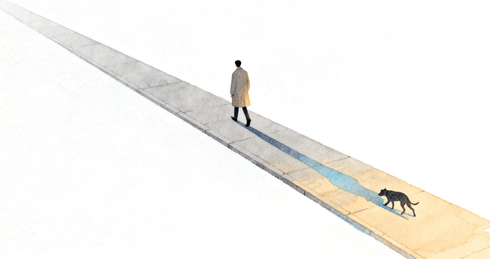

"Trust your intuition." We have all heard this. But maybe not many of us have stopped to ask: what is intuition, and why is it worth trusting?

We all learned about evolution in school. Counting backwards, we are Homo sapiens, and before that apes, and before that mammals and reptiles, and if you keep going, the origin was probably some single-celled thing in the water, roughly the shape of a paramecium. An enormous amount had to happen between a cell like that and a living, thinking human being. And whatever carried that line of life all the way to today is still sitting inside our bodies.

Billions of years of getting things wrong. Most of those mistakes vanished along with the individual who made them, and what stayed behind was whatever genuinely helped something stay alive.

Intuition is what those billions of years left us.

Here is an example. You are walking down a pitch-dark path when something feels off. You turn around, and often enough there really is something — the shadow of a tree, or some small animal. This is not the result of reasoning; there is no time to reason. Thousands of faint signals around you, light and sound and smell, get compressed in an instant into a single thought: something is wrong.

It is fast, fast enough that you cannot explain it to yourself. But it matters — it is exactly this thing you cannot explain that kept us alive.

### But it was accumulated in an older world

Intuition also gets things wrong sometimes.

The reason is not complicated. This body of experience was accumulated out in the wild. It was accumulated back when we were apes, and back when we were reptiles. The world changed. It has not caught up.

Take our love of sweet things. Food used to be scarce, and one extra bite was a good thing, so the ones with a sweet tooth survived. Drop that same instinct into today and it stops doing us any favors.

Or take the nerves that come with speaking in front of a crowd. A few million years ago, in a small tribe, saying the wrong thing and being driven out was more or less a death sentence. Today the worst case is that someone laughs, and before long nobody remembers what you said anyway. But the body still tells you: this matters, you had better be nervous, because if you botch it you might not survive.

That is wrong.

### The other half

That said, intuition matters and deserves respect. It tells us what to do. But when a situation is one you can see clearly, reason tends to be the more reliable of the two.

So we should respect intuition, and we should also know when it stops working.

Steve Jobs said a famous line at Stanford: have the courage to follow your heart and intuition.[^1] Knowing when it stops working is the half that line leaves unsaid.

[^1]: "Have the courage to follow your heart and intuition." — Steve Jobs, Stanford Commencement Address, 2005.
